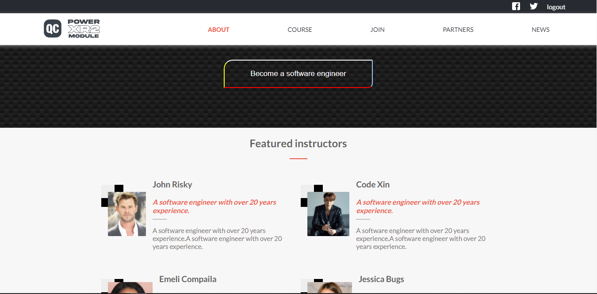

# Web Development Course Capstone Project

> This is my capstone project website showcasing my skills and mastery of HTML, CSS, JAVASCRIPT and responsive design.

## Built With

- HTML
- CSS
- JAVASCRIPT

## Live Demo 🔗

[Live Demo Link](https://codepantha.github.io/capstone-project-1/)

## Getting Started

**This is my capstone project website showcasing my skills and mastery of HTML, CSS, JAVASCRIPT and responsive design, showing proficiency in the programming languages listed above**

To get a local copy up and running follow these simple example steps.

### Prerequisites
There are no prerequisites

### Setup
Just clone the repository to your local machine and you are all set.
`git clone https://github.com/codepantha/Portfolio.git`

## Authors

👤 **Author**

- GitHub: [@codepantha](https://github.com/codepantha)
- Twitter: [@codepantha](https://twitter.com/codepantha)
- LinkedIn: [promise-eze](https://linkedin.com/in/promise-eze)

## 🤝 Contributing

Contributions, issues, and feature requests are welcome!

Feel free to check the [issues page](../../issues/).

## Show your support

Give a ⭐️ if you like this project!

## Acknowledgments

- Thanks to [Cindy Shin](https://www.behance.net/adagio07) whose design this project is modeled after.

## 📝 License

This project is [MIT](./MIT.md) licensed.
